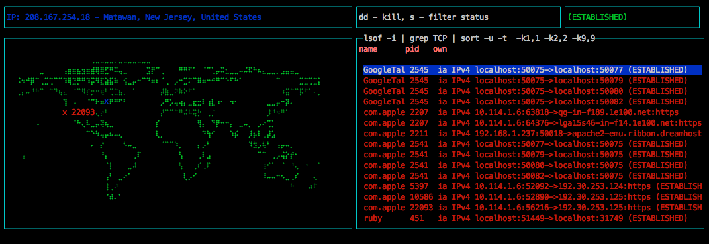

Terminal dashboard for TCP connections. (Thanks, [blessed](github.com/yaronn/blessed)). 

- World map plots your IP geolocation, along with location for connected IPs if available via [Maxmind](www.maxmind.com)'s GeoLite 2 db. 
- List of TCP connections per second, filterable by status.

### Install
`npm install -g waldo-top`

### Use it
`waldo`
